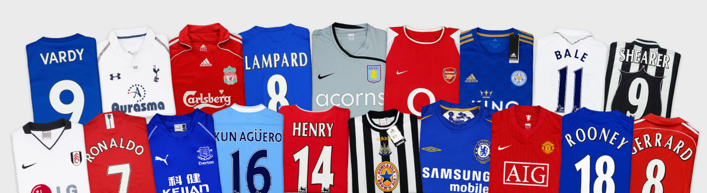

# Vintage Football Shirts

## Overview:
This exam project aims to create a platform for enthusiasts of vintage football shirts, where users can be a part of the retro football shirts world.

## Features:
- Fullstack TypeScript Project with Frontend and Backend
- Use of MongoDB Database
- Use of GraphQL for Communication Between Frontend and Backend
- GraphQL Mutations and Queries for Creating and Updating Models and Relations
- Use of React for the Frontend
- Use of Node.js, Express, Mongoose, and Apollo Server for the Backend
- TypeScript for Both Frontend and Backend
- Minimum of 3-4 Models (with a total of 5 models)
- Use JWT for authentication
- The frontend has role-based routing (admin and customer, only visible to logged in users with the correct role)

